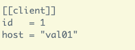
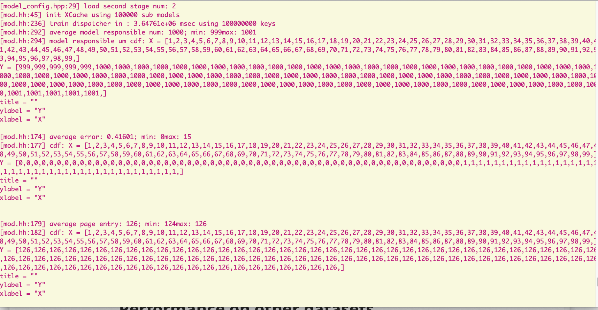

# Before the start
This is the legacy codebase of XStore. 
Please check [XStore](https://ipads.se.sjtu.edu.cn/pub/projects/xstore) for the latest version.

# Overview
XStore is an RDMA-enabled **ordered** key-value store targeted at a client-sever setting. Specifically, the server has an in-memory B+Tree; and the client uses one-sided RDMA READs to traverse the B+Tree. To accelerate the lookup, we deploy a learned cache (xcache) at the client to accomplish the traversal in one round-trip (if the learned cache is all cached). Even if the xcahe is not cached, XStore client only needs at most 2 round-trips for the traversal. 

**Recommended hardware setup** 

- **RDMA:** As XStore leverages RDMA's feature, we recommend using RDMA NIC with good one-sided performance. For Mellanox NICs, we recommend using recent generations of NICs, including **ConnectX-4** or **ConnectX-5**. 
- **RTM:** XStore server uses Intel restricted transactional memory (RTM) to coordinate server's concurrent threads. Recent generations of processor later than Haswell all have RTM. (Note that some processor may disable this feature; please contact us if you want to re-enable RTM). 
- **Operation system**. We use `Ubuntu 16.04.2` with `Linux Linux 4.4.98` for evaluating XStore. Yet, we believe XStore does not depend on a specific OS version. 

***

# Getting started 
XStore's codebase will automatically download most of the dependent packages 
(either using `git submodule` or `cmake external project`).
There are two exceptions: **Intel MKL** and **Mellanox OFED**.
Below, we first briefly describe how to install them. 

- **Intel MKL**
There are two ways to install Intel MKL.
One way is to download the install package from its official website. 
For example, we downloaded a tar file named `l_mkl_2020.3.279`.
After untar it, we run the `./install.sh` and follow its instructions to complete the installation.
Note that the install process may depend on cpio, which can be installed by `apt-get update; apt-get install cpio`.
Another way is to install it from `apt`.
Please follow the instructions at [](https://software.intel.com/content/www/us/en/develop/articles/installing-intel-free-libs-and-python-apt-repo.html) for the detailed information.

After installing the Intel MKL, please modify `build-config.toml`; and adjust the following **path**， **lib** and  **include** path in XStore's build configure to where you have installed the MKL:


For example, the header file of our sampled install configuration is `/opt/intel/mkl/include` .

- **Mellanox OFED**
After downloading the specific OFED from [OFED](https://www.mellanox.com/products/infiniband-drivers/linux/mlnx_ofed),
we use `mlnxofedinstall --without-iser-dkms --without-srp-dkms --without-srptools --force` to install it.

For other dependencies, XStore only depends on some python packages for bootstrapping the automatic process.
We recommend using `pip` to install the dependencies, using the following command:

- `cd *path_to-xstore; pip3  install -r requirements.txt`

After that, please go to the next section to build XStore.

# Build XStore
Note that we assume you have manually installed **Intel MKL** and adjust the `build-config.toml`. Then, we generate the build configuration cmake files using `build-config.toml`. Use the following command:

- `cd *path_to-xstore*`
- **(optional, executed if xstore is extracted from a compressed file (e.g., zip)) **`git init`
- `python3 magic.py config -f build-config.toml` (may take 5-10 minutes depends on the network)
  (optional) If the `git submodule add`  failed; please use `git submodule update --init` to retry. 

It will generate a `CMakeList.txt`, together with cloning some necessary dependencies.  After that, we can use the `cmake` build system to build the related components of XStore. 

- `cd *path_to-xstore*`

- `cmake .`

We then build some specific dependencies (with source code already downloaded with `magic.py` in the previous step). 

- `cd deps/jemalloc; autoconf`;  `cd *path_to_xstore*; make jemalloc;` 
- `make boost` (may take 5-15 minutes depends on the compilation time and network)

After building the dependencies, we can now build XStore.

- `cd *path_to_xstore*;`
- `make fserver; make ycsb; make micro; make master` (should take less than 5 minutes)

A brief preview of the built executables: `fserver` is the main key-value store server of XStore, while `ycsb` and `micro` are the clients. `master` is responsible for collecting and printing the benchmark results in a readable format from different clients. 

**Possible error**: If there is link error to `boost` or `jemalloc`, please re-execute `cmake .` and then execute `make fserver; make ycsb; make micro; make master`.

***

# Specific configurations

XStore client/server may customize their core binding, and each thread's NIC selection based on our hardware setup. For example, please view `./benchs/arc/val/net_config.hh`, which provides customizations for the RNIC selection (Our compute node is called `val`, which has two NICs). The `choose_nic(int tid)` return the [0..max_nic_on_one_machine) given a thread id. On our platform, which has 24 cores and two NICs per machine, the 0-11 threads will use the **second** NIC , while 11-23 will use the first NIC. Please change this configurationfor your platform if necessary. For example, if one machine only has one NIC, please modify `choose_nic` to make it always return 0. 

Don't forget to rebuild with `make fserver; make ycsb; make micro; make master` after the configurations!


***

# Run experiments with `bootstrap.py`
Ideally, using `./fserver` will start an XStore server instance. Please use `./fserver --help` to check the configuration commands. Further, `./ycsb --help` will start a client instance of XStore, which executes YCSB benchmark. However, we usually need to start multiple clients, and doing this all in a distributed setting is tedious. We use a script, `./bootstrap.py` to start many instances. 

The `./bootstrap.py` adopts a configuration file (in `toml` format), which identifies which executable to run on which machine. An example of running config (`sample.toml`) is listed below (in `sample.toml`):

```toml
[[pass]]
host = "val10"
path = "/cock/fstore"
cmd = "./fserver --help"

[[pass]]
host = "val11"
path = "/cock/fstore"
cmd = "./ycsb --help"
```

using `./bootstrap.py -f sample.toml` will execute a `./fserver --help` at machine val0 while execute `./ycsb --help` at machine val1. The results are as follows, which prints the output of each machine （assuming `ycsb` and `fserver` have been copied to `/cock/fstore` at `val10` and `val11`, or `/cock/fstore` is a path at the an NFS server: 


The `sample-kv.toml` provides the simplest form of running script, which uses one server and one client threads. The client uses xcache to execute YCSB-C on the server with one thread.  After executing it with `./bootstrap.py -f sample-kv.toml`, the results are as follows:


*Note that using `ycsb` without `master` may causes some error after the client exit, but it is fine. We recommend using the scripts in the following sections to reproduce our results (with `master`, which can correctly exit*.

To facilitate the reproduce the results, we provide the original configuration files to run each experiment (see the next section). However, one should tune their setting according to their machine platform. 

**Clean up:** Finally, let's talk about what happens when the `bootstrap` exits. Ideally, after `./bootstrap.py` exit (either by Ctrl-C or normally exit), the remote processes should be killed. However, when using `./bootstrap.py` after some proxies, the remote executable may still be running. Consequently, we recommend using a `kill.toml` to kill all the remaining processes with `./bootstrap.py -f kill.toml`. The sample kill script (`kill.toml`) is listed in the `./path_to_xstore`. 


***


# Main results in the paper and how to reproduce them

The following table summarizes the main results in the paper and their corresponding 
running scripts. We further give the command is used to execute the script. 

XStore's performance on YCSB (uniform, corresponds to Fig.10 in the paper):

| Benchmark | script file               | running command                             |
| --------- | ------------------------- | :------------------------------------------ |
| YCSB-A    | `./ae_scripts/ycsba.toml` | `./bootstrap.py -f ./ae_scripts/ycsba.toml` |
| YCSB-B    | `./ae_scripts/ycsbb.toml` | `./bootstrap.py -f ./ae_scripts/ycsbb.toml` |
| YCSB-C    | `./ae_scripts/ycsbc.toml` | `./bootstrap.py -f ./ae_scripts/ycsbc.toml` |
| YCSB-D    | `./ae_scripts/ycsbd.toml` | `./bootstrap.py -f ./ae_scripts/ycsbd.toml` |
| YCSB-E    | `./ae_scripts/ycsbe.toml` | `./bootstrap.py -f ./ae_scripts/ycsbe.toml` |

Other evaluation results of YCSB can be simply reproduced with those scripts (by adjusting some parameters). For example, to replay the experiment in Fig.12, we only need to adjust the number of clients and each client's concurrency factor in `./ae_scripts/ycsbc.toml'` for measuring the latency and throughput graph. Further, Fig.11 only records the data in a more fine-grained style. 

**Tips to run these scripts:**  As we have mentioned, using `./bootstrap.py` is sufficient to run these scripts. For example, `./bootstrap.py -f ./ae_scripts/ycsba.toml` will execute the experiment we use to produce the results of YCSB-A. However, the script assumes some specific host mapping. Consequently, please change the host name and configuration, together with `cs.toml` which records the client mapping. 



For example, this means that client with id 1 (**client id should be greatly than 0**) is on host `val01`. 

If you are unsure how to adapt these configurations to your cluster, please contact me with the cluster setup you want to run XStore. 


**Evaluations of model expansion: ** The script of  reproducing the experiment of model expansion (corresponds to Fig. 14 a) is in `ae_scripts/expan.toml`. 

***


# Statistical data of XStore

Other evaluation focsuing on XStore's internal statistical, e.g., the accuracy and the training time. XStore server will print most of these information. For example, when executes

`./fserver -db_type ycsb --threads 24 --id 0 -ycsb_num=100000000 --no_train=false --step=2 --model_config=ae_scripts/ycsb-model.toml` , the screen will print something like: 



Which will measurements of the accuraccy of XStore and the time for training the model when training a YCSB dataset with 100000000 number of tuples. The XStore is trained using model configurations of `ae_scripts/ycsb-model.toml`. 

For example, `average error` measures the average error per model; it further prints out the CDF of  trained result.

***

# Performance on other datasets

Our main evaluations in the paper focus on YCSB's default key distribution. Fig.15 evaluates the performance of XStore on more complicated data-sets.

- For example, `./bootstrap-new.py -f ./ae_scripts/ln.toml` evaluates XStore on a noised linear dataset. For OSM, however, we load the KVS from a large file. So we skip this evaluation in the AE. 

Don't forget to change the configurations file in `ln.toml` and `cs.toml`,  like previous sections. 


***

# Adjusting the XCache SZ

The default setting of XStore assumes the XCache has all been fetched to the client. However, it may still consume some memory because XStore uses TT, which could be large. Yet, XStore still behavior well when there is less sufficient memory.  Fig.14c and Fig.14d show this. To reproduce these results, first open `./benchs/ycsb/clients.hpp` and search `CACHED_SC`. In default, we set it 0 zero. To set it to 1 to enable it (like `#define CACHED_SC 1`). 

After re-compiling with  `make fserver; make ycsb; make micro; make master`, you can use` ./ae_scripts/cached_ycsbc.toml`  to evaluate the performance of XStore when the client has a constraint memory budget. For example,  `cache_sz_m ` means that each client cache at most 50M XCache. Typically, ~100MB memory budget is sufficient for client to achieve the optimal performance on YCSB with 100,000,000 tuples. 


# Evaluations of the baseline B+Tree

The one-sided RDMA READ-based B+Tree used a different structure than XStore's B+Tree to support dynamic workload. It is on a separate branch other than our submitted repo. If you are interested in reproducing the B+Tree results, please contact me. 

